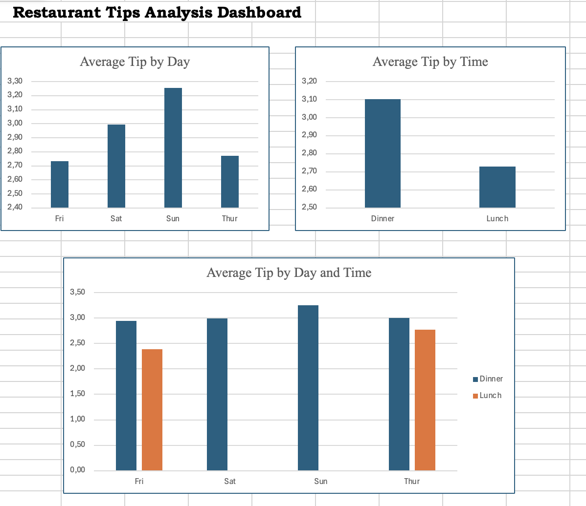

# Restaurant Tips Analysis

## Project Overview
This project analyzes restaurant tipping behavior using Excel Pivot Tables and dashboard visualization.

## Analysis
- Average Tip by Day
- Average Tip by Time
- Average Tip by Day and Time
- Average Tip by Gender
- Average Tip by Smoker

## Key Insights
- Sunday has the highest tips
- Dinner tips are higher than lunch
- Sunday dinner is the most profitable period
- Male customers leave slightly higher tips
- Smokers leave slightly higher tips

## Dashboard

## Tools Used
- Excel
- Pivot Tables
- Dashboard